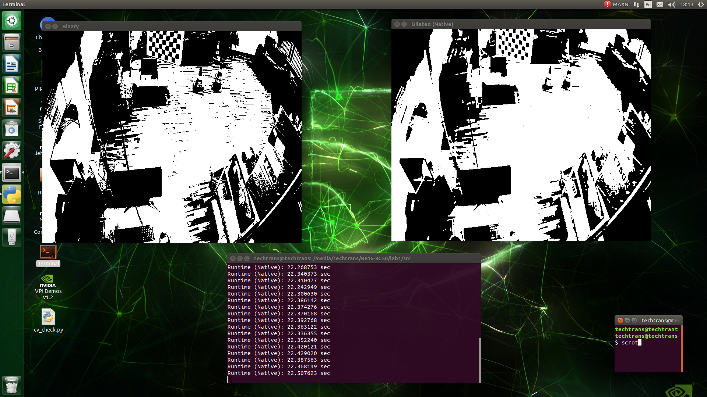

# Лабораторная работа №1

## Цель работы

Научиться реализовывать один из простых алгоритмов обработки изображений.

## Задание 

1. Реализовать программу согласно варианту задания. Базовый алгоритм, используемый в программе, необходимо реализовать в 2 вариантах: с использованием встроенных функций какой-либо библиотеки (OpenCV, PIL и др.) и нативно на Python (или C++).
2. Сравнить быстродействие реализованных вариантов.
3. Сделать отчёт в виде readme на GitHub, там же должен быть выложен исходный код.

### Примечение:

Программа работает с видео. На вход должен поступать видеопоток с устройства (камеры) или видео должно читаться из файла. 
Каждый алгоритм нужно реализовать в 2 вариантах: с использованием сторонних библиотек на Python и с помощью примитивных 
операций и циклов на Python (можно использовать NumPy массивы) – либо на C++.

## Вариант

Дилатация бинаризованного изображения (бинаризацию можно
сделать с помощью реализации из OpenCV, структурный элемент
читать из файла или матрицей задавать в коде).

## Теоретическая база 

**Дилатация** - это одна из морфологических операций обработки изображений, которая применяется к бинарному изображению. 
Бинарное изображение состоит из пикселей, принимающих значения 0 или 1 (черный или белый).

**Принцип работы дилатация:** для каждого пикселя в изображении расширяется его окрестность и устанавливается 
значение пикселя в максимальное значение в этой окрестности. Это может быть полезно для увеличения размера объектов, 
заполнения дырок или объединения близко расположенных объектов.

## Описание разработанной системы

### ***1. Функция gstreamer_pipeline:*** 
Эта функция, которая возвращает строку конвейера GStreamer для захвата видео с камеры. Этот конвейер оптимизирован для 
использования с камерами NVIDIA Jetson CSI.

```python
def gstreamer_pipeline(
        capture_width=1280,
        capture_height=720,
        display_width=1280,
        display_height=720,
        framerate=30,
        flip_method=0,
    ):
    return (
            "nvarguscamerasrc ! "
            "video/x-raw(memory:NVMM), "
            "width=(int)%d, height=(int)%d, "
            "format=(string)NV12, framerate=(fraction)%d/1 ! "
            "nvvidconv flip-method=%d ! "
            "video/x-raw, width=(int)%d, height=(int)%d, format=(string)BGRx ! "
            "videoconvert ! "
            "video/x-raw, format=(string)BGR ! appsink max-buffers=1 drop=true"
            % (
                capture_width,
                capture_height,
                framerate,
                flip_method,
                display_width,
                display_height,
            )
    )
```

### ***2. Функция binary_thresholding:*** 
Эта функция выполняет бинарную пороговую обработку изображения, преобразуя его в черно-белое изображение 
(бинарное изображение) на основе порогового значения.


```python
def binary_thresholding(image):
    _, binary_image = cv2.threshold(image, 127, 255, cv2.THRESH_BINARY)
    return binary_image
```

### ***3. Функция dilate_with_opencv:*** 
Эта функция использует библиотеку OpenCV для выполнения дилатации (расширения) бинарного изображения с использованием 
заданного ядра.

```python
def dilate_with_opencv(binary_image, kernel):
    dilated_image = cv2.dilate(binary_image, kernel, iterations=1)
    return dilated_image
```

### ***4. Функция dilate_without_opencv:*** 
Эта функция реализует дилатацию без использования OpenCV, применяя ядро напрямую к изображению.

```python
def dilate_without_opencv(binary_image, kernel):
    height, width = binary_image.shape
    dilated_image = np.zeros((height, width), dtype=np.uint8)

    kernel_indices = np.argwhere(kernel == 1)

    for i, j in zip(*np.where(binary_image == 255)):
        for m, n in kernel_indices:
            if 0 <= i + m < height and 0 <= j + n < width:
                dilated_image[i + m, j + n] = 255

    return dilated_image
```

### ***5. Функция compare_execution_time:*** 
Эта функция сравнивает время выполнения дилатации с использованием OpenCV и без него для заданного бинарного изображения 
и ядра. Выводит результаты в терминал.

```python
def compare_execution_time(binary_image, kernel):
    start_time_opencv = time.time()
    dilate_with_opencv(binary_image, kernel)
    end_time_opencv = time.time()

    start_time_native = time.time()
    dilate_without_opencv(binary_image, kernel)
    end_time_native = time.time()

    print("Runtime (OpenCV): {:.6f} sec".format(end_time_opencv - start_time_opencv))
    print("Runtime (Native): {:.6f} sec".format(end_time_native - start_time_native))
```
### ***6. Функция main:*** 
Это основная функция программы. Она инициализирует видеопоток с помощью GStreamer, создает окно для отображения видео, 
считывает кадры, преобразует их в черно-белое изображение, выполняет дилатацию с использованием OpenCV и без него, 
затем сравнивает время выполнения и выводит результаты.

```python
def main():
    print(gstreamer_pipeline(flip_method=4))
    cap = cv2.VideoCapture(gstreamer_pipeline(flip_method=4), cv2.CAP_GSTREAMER)
    kernel = np.array([[1, 1, 1],
                       [1, 1, 1],
                       [1, 1, 1]], dtype=np.uint8)
    if cap.isOpened():
        window_handle = cv2.namedWindow("CSI Camera", cv2.WINDOW_AUTOSIZE)
        # Window
        while cv2.getWindowProperty("CSI Camera", 0) >= 0:

            ret_val, frame = cap.read()
            gray_frame = cv2.cvtColor(frame, cv2.COLOR_BGR2GRAY)
            binary_frame = binary_thresholding(gray_frame)

            dilated_frame_opencv = dilate_with_opencv(binary_frame, kernel)
            dilated_frame_native = dilate_without_opencv(binary_frame, kernel)

            compare_execution_time(binary_frame, kernel)

            # cv2.imshow('Original', frame)
            # cv2.imshow('Binary', binary_frame)
            # cv2.imshow('Dilated (OpenCV)', dilated_frame_opencv)
            # cv2.imshow('Dilated (Native)', dilated_frame_native)

            keyCode = cv2.waitKey(1) & 0xFF
            # Stop the program on the ESC key
            if keyCode == 27:
                break
        cap.release()
        cv2.destroyAllWindows()
    else:
        print("Unable to open camera")
```
Кроме этого, также было реализовано подключение rtsp-камеры в отдельном файле [dilation_rtsp.py](./src/dilation_rtsp.py), 
в котором в ***cap = cv2.VideoCapture(rtsp_url)*** напрямую передается ссылку на камеру.

## Результаты работы и тестирования системы

Тестирование работы проводилось на Jetson nano версии Jetpack 4.6.1 с следующими характеристиками:


Видео было получено с к IP-камеры UNIVIEW IPC3612LR-MLP28-RU

#### В ходе тестирования было получены следующие результаты:

Запуск дилатации с помощью встроенной функции OpenCV **cv2.dilate**:


Запуск дилатации с помощью библиотеки **numpy**:



## Вывод

Встроенная функция OpenCV обрабатывает и выводит кадры бесшовно, то есть со средней скоростью обработки одного кадра 
0.0007 секунд, в то время как реализация дилатации с помощью numpy имеет среднее скорость обработки одного кадра
23 секунды, из чего можно сделать вывод, что использование встроенной функции **cv2.dilate** является более удобным 
механизмом. 

## Использованные источники

#### [Документация OpenCV](https://docs.opencv.org/4.x/)