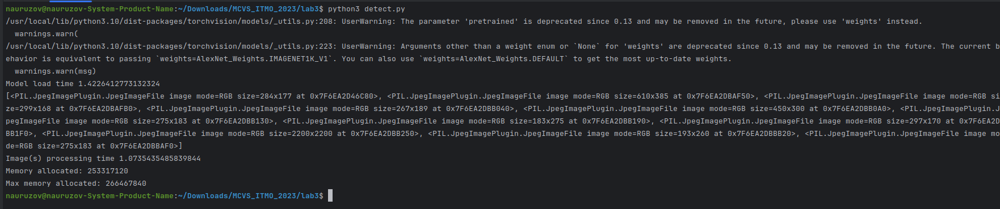

# Лабораторная работа №3

## Цель работы

Изучить основы реализации глубоких нейронных сетей на мобильных
системах, а также методы их оптимизации.

## Задание 

1. Изучить принципы построения глубоких нейронных сетей, их разновидности, архитектуры (применительно к обработке
   изображений и видео).
2. Изучить способы реализации нейросетевых вычислений (CPU, GPU).
3. Реализовать систему обработки изображений на основе нейронной
сети (назначение и архитектуру сети выбрать самостоятельно, это
может быть предобученная сеть для детектирования объектов,
сегментации, классификации, построения карты глубины, вычисления
оптического потока). Реализация обучения сети не требуется.
Приложение должно принимать на вход реальное изображение
(изображения) и выводить результат (обработанное изображение или
полученную из него информацию, рис. 1).


Рис. 1. Примеры входного и выходного изображений

1. Оптимизировать выбранную сеть с помощью TensorRT.
2. Оценить следующие характеристики:
 - Время выполнения программы и количество используемой памяти
при использовании сети без оптимизации.
 - Производительность и потребление памяти при использовании
TensorRT.
 - Изменение выхода сети (числовых значений) при использовании
TensorRT при одинаковых входных данных.
 - Возможность применения реализованной системы в real-time
приложениях.

### Примечение:

Измерение скорости выполнения алгоритма должно быть выполнено несколько раз с последующим усреднением для минимизации влияния
степени загруженности вычислительных ресурсов другими процессами.
Отдельно необходимо измерить время загрузки весов сети в память и непосредственно обработки изображений (в потоке).
Можно взять любую архитектуру и задачу, например, ResNet-18 для задачи классификации.


## Теоретическая база 

### Принципы построения глубоких нейронных сетей:
1. Глубина сети:
   - Использование множества слоев для извлечения иерархических признаков.
2. Свёрточные слои (Convolutional Layers):
   - Применение свёрточных операций для выделения пространственных признаков в изображениях.
3. Пулинг (Pooling):
   - Применение операций пулинга для уменьшения размерности и сохранения важных признаков.
4. Функции активации:
   - Применение нелинейных функций активации, таких как ReLU (Rectified Linear Unit), для внесения нелинейности в модель.
5. Batch Normalization:
   - Нормализация активаций для более стабильного обучения и ускорения сходимости.
6. Dropout:
   - Использование слоев dropout для предотвращения переобучения и повышения обобщающей способности модели.
7. Функции потерь:
   - Выбор соответствующих функций потерь в зависимости от задачи (например, кросс-энтропия для задачи классификации).
8. Оптимизаторы:
   - Применение оптимизаторов (например, Adam, SGD) для обновления весов сети в процессе обучения.

### Разновидности глубоких нейронных сетей:

1. Сверточные нейронные сети (CNN):
   - Специализированы для обработки изображений с использованием свёрточных слоев.
2. Рекуррентные нейронные сети (RNN):
   - Подходят для работы с последовательными данными, такими как видео, благодаря рекуррентным слоям.
3. Глубокие архитектуры:
   - Примеры включают ResNet, Inception, и MobileNet, предназначенные для решения конкретных проблем.

### Архитектуры для обработки изображений и видео:

1. ResNet (Residual Networks):
   - Используют блоки с "остаточными" связями для борьбы с проблемой затухания градиентов.
2. Inception (GoogLeNet):
   - Использует параллельные свёрточные операции различного размера ядра для извлечения признаков.
3. VGG (Visual Geometry Group):
   - Простая и эффективная архитектура с множеством свёрточных слоев.
4. MobileNet:
   - Оптимизирована для мобильных устройств, использует depthwise separable convolutions для уменьшения вычислительной сложности.

Существует несколько способов реализации нейросетевых вычислений на различных устройствах, таких как процессоры (CPU) 
и графические процессоры (GPU). Вот несколько основных подходов:

### На процессоре (CPU):

1. Использование библиотек глубокого обучения:
   - TensorFlow: TensorFlow поддерживает выполнение вычислений на CPU. Вы можете создавать и обучать нейронные сети, используя API TensorFlow.
   - PyTorch: PyTorch также предоставляет поддержку выполнения на CPU и обеспечивает гибкость в построении и обучении моделей.
2. NumPy и SciPy:
   - NumPy и SciPy предоставляют базовые операции для работы с массивами и вычислений, что можно использовать для реализации простых моделей нейронных сетей.

### На графическом процессоре (GPU):

1. CUDA (Compute Unified Device Architecture):
   - NVIDIA CUDA является платформой для параллельных вычислений на GPU. Многие библиотеки глубокого обучения, такие 
как TensorFlow и PyTorch, используют CUDA для ускорения обучения моделей на GPU.
2. OpenCL (Open Computing Language):
   - OpenCL является открытым стандартом для параллельных вычислений, поддерживаемым различными производителями GPU. 
Этот стандарт может быть использован для разработки приложений с использованием GPU разных производителей.
3. ROCm (Radeon Open Compute):
   - ROCm - это открытая платформа для разработки параллельных приложений на GPU от AMD. Она поддерживает 
многие библиотеки глубокого обучения, такие как TensorFlow и PyTorch.

### Универсальные подходы:

1. Intel oneAPI:
   - Платформа oneAPI от Intel обеспечивает универсальный набор инструментов для разработки приложений на различных 
устройствах, включая CPU, GPU и FPGA.
2. ONNX (Open Neural Network Exchange):
   - ONNX - это открытый формат обмена моделями между различными библиотеками глубокого обучения. Многие фреймворки, 
такие как PyTorch и TensorFlow, поддерживают экспорт и импорт моделей в формате ONNX, что обеспечивает переносимость моделей между различными устройствами и фреймворками.


## Описание разработанной системы
Для выполнения лабораторной работы была выбрана модель **alexnet** - сверточная нейронная сеть, которая оказала большое 
влияние на развитие машинного обучения, в особенности — на алгоритмы компьютерного зрения. Сеть с большим отрывом 
выиграла конкурс по распознаванию изображений ImageNet LSVRC-2012 в 2012 году (с количеством ошибок 15,3% против 26,2% у второго места).

Кроме этого использовались библиотеки torch, torchvision и torch2trt.
#### Функция по обработке изображений:

```python
def image_processing(images: list,
                   trt: bool):
    times = time.time()
    if trt:
        # x = torch.ones((1, 3, 224, 224)).cuda()
        # model = alexnet(pretrained=True).eval().cuda()
        # model_trt = torch2trt(model, [x])
        # torch.save(model_trt.state_dict(), 'alexnet_trt.pth')
        # model = model_trt
        model = TRTModule()
        model.load_state_dict(torch.load('alexnet_trt.pth'))
    else:
        model = alexnet(pretrained=True).eval().cuda()
    print("Model load time {}".format(time.time() - times))

    times = time.time()
    for image in images:
        index = image_classification(image, model)
        output_text = str(index) + ': ' + classes[index]
        edit = ImageDraw.Draw(image)
        edit.rectangle((0, image.height - 20, image.width, image.height),
                       fill=(255, 255, 255))
        edit.text((50, image.height-15), output_text, (0, 0, 0),
                  font=ImageFont.load_default())
        image.save('./output/' + image.filename.split('/')[-1])
    print(images)
    print("Image(s) processing time {}".format(time.time() - times))
    print('Memory allocated: ' + str(torch.cuda.memory_allocated()))
    print('Max memory allocated: ' + str(torch.cuda.max_memory_allocated()))
```

#### Функция по классификация изображений:

```python
def image_classification(image: Image,
                   model) -> int:
    image_tensor = transform(image).float()
    image_tensor = image_tensor.unsqueeze_(0)
    input = Variable(image_tensor).to(device)

    output = model(input)
    return output.data.cpu().numpy().argmax()
```

#### Основная функция:

```python
def main(argv: list,
         trt: bool = False):
    try:
        opts, empty = getopt.getopt(argv, "", ["trt"])
        if len(opts) == 1:
            trt = True
            argv.remove('--trt')
        elif len(opts) > 1:
            raise getopt.GetoptError("is not a directory.")
    except getopt.GetoptError:
        print_usage()
        sys.exit(1)

    for file in glob.glob('data/*.jpg', recursive=True):
        try:
            image = Image.open(file)
            images.append(image)
        except FileNotFoundError:
            print(file + " not found")

    if len(images) == 0:
        print_usage()
        sys.exit(1)

    image_processing(images, trt)
```

## Результаты работы и тестирования системы

Таблица результатов тестирования модели по классификации 11 изображений:

|        Имя        | Работа модели, сек | 	Обработка изображений, сек	 | Максимальное количество выделенной памяти, байт |
|:-----------------:|:------------------:|:----------------------------:|:-----------------------------------------------:|
|      Без TRT      |       	20.15       |            63.43             |                   	257949184                    |
|        TRT        |        	60         |             3.5              |                     	606208                     |
| TRT (сохраненное состояние) |        	35        |             3.5              |                     	606208                     |


Рис. 2. Результаты работы без TRT

## Вывод
Процесс загрузки готовой модели оказался не сложным, так как ее веса и сама модель имеется в библиотеке torchvision.
Кроме того по результатам тестирования стало понятно, что обработка одного кадра с TRT в 9-10 раз быстрее, чем обработка
аналогичной моделью без TRT и потребляет намного меньше памяти. 

## Использованные источники

#### [Документация Torch](https://pytorch.org/docs/stable/index.html)
#### [Документация Torchvision](https://pytorch.org/vision/stable/index.html)
#### [Документация Torch2trt](https://github.com/NVIDIA-AI-IOT/torch2trt)
