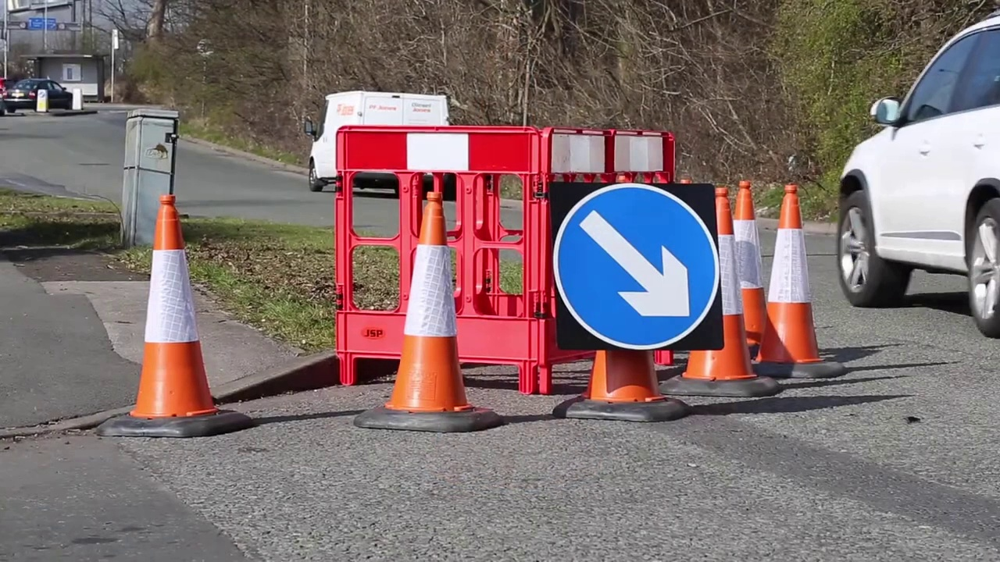
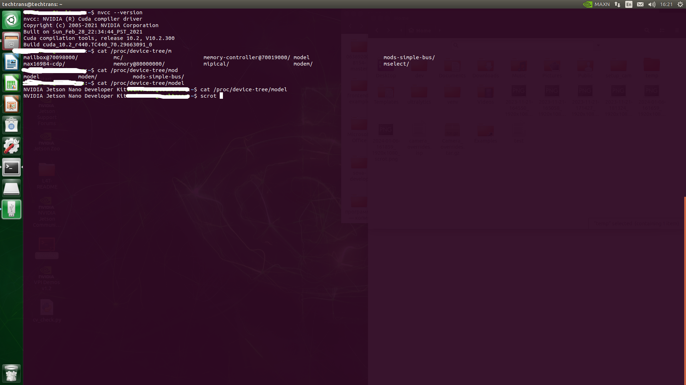
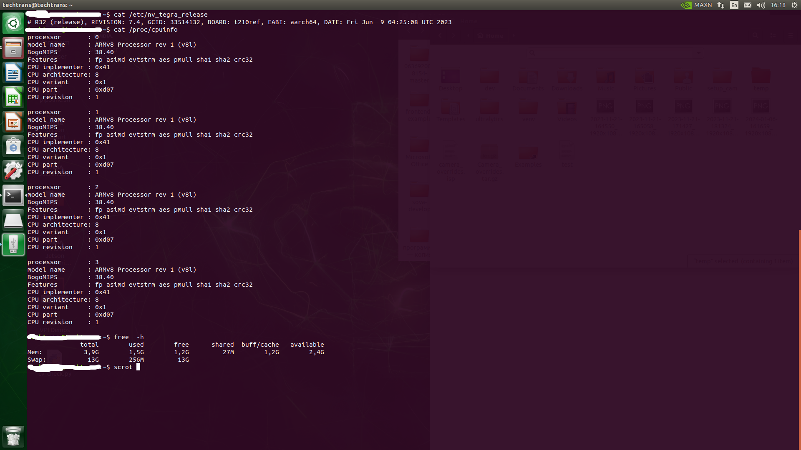
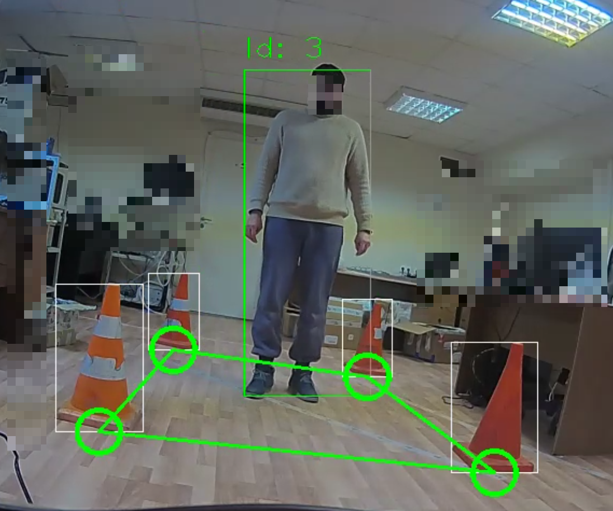
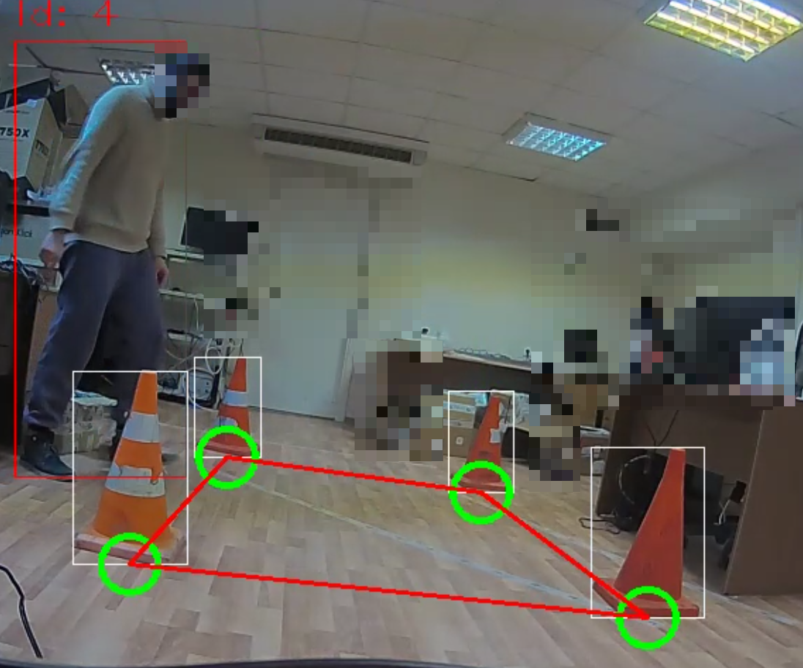
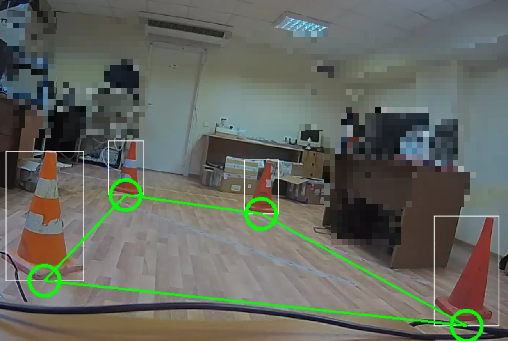

# Лабораторная работа №4

## Цель работы

Создать прикладную систему компьютерного зрения на базе Jetson Nano.

## Задание

1. Выбрать и зафиксировать в Google таблице курса тему проекта.
2. Разработать требования к системе.
3. Разработать архитектуру системы.
4. Реализовать систему обработки видео с использованием ИИ и алгоритмов
компьютерного зрения.
5. Оценить потребление ресурсов при функционировании системы и технические
характеристики (быстродействие, а также специфичные для проекта значения.
например, ошибку классификации, требования к характеру изображения и т. д.).

### Инструментальные средства

Лабораторная работа выполняется на языке Python с использованием библиотек pytorch,
torchvision, TensorRT (альтернативно может быть использован язык C++ и
соответствующие API библиотек), в качестве платформы используется одноплатный
компьютер Jetson Nano.

## Теоретическая база

### Выбранная тема проекта

Нашей командой была выбрана тема проекта "Определения разрешенной зоны нахождения человека", которая построена по 
принципу обнаружения конусов и построения с их помощи контура безопасной зоны. 

### Требование к системе: 
1. Работа в реальном времени;
2. Обработка более 2 кадров в секунду;
3. Изменения контура и фигуры зоны при нажатии на кнопку.

### Архитектура системы

#### Этап №1

В качестве модели детекции была взята предобученная yolov8 размерности `n` разрабатываемая сообществом разработчиков Ultralytics, которая
имеет расширение `.pt`. Далее для дообучения модели она была переведена в формат `.onnx` с помощью следующего скрипта:

```
from ultralytics import YOLO

model = YOLO("best_new.pt")  # load a pretrained model (recommended for training)
success = model.export(format="onnx", imgsz = (640,640))  # export the model to ONNX format
```
   После чего на заранее подготовленных данных с помощью скрипта, который имеется в официальном репозитории 
   [Ultralytics](https://github.com/ultralytics/ultralytics) модель была дообучена детектировать конусы.



Рис. 1. Пример картинки использованной в ходе обучения:

При этом установлена входная размерность кадра 640х640.

#### Этап №2

##### Описание модулей

## 1. VideoCapture.py

Реализует захват последнего кадра из RTSP потока

* Название класса `VideoCapture`

* методы схожи с методами opencv

**ВАЖНО: выполнить метод класса release, чтобы освободить поток**

## 2. plot.py

Класс с набором функций отрисовки.

Основные функции:

* `draw_rectangles` - отображение прямоугольников bbox;

* `draw_middel_point` - отображение средней нижней точки bbox;

* `draw_polygon` - отрисовка полигона;

## 3. sort.py

Алгоритм трекинга объектов:

* требуется установка зависисмости `pip3 install filterpy` 

* класс `Sort(max_age=1,min_hits=3,iou_threshold=0.5)`


## 4. video_recording.py

Записывает фрейм в видео и сохраняет в заданное место.

* `VideoRecording` - класс;

* аргументы конструктора по умолчанию `os.getcwd()+'/output_videos/', max_dir_size_gb = 5, num_videos2remove = 10, video_length = 10`

* метод для записи `record(self,frame,fps)`

## 5. video_writer.py

Класс для записи видеопотока с использованием библиотеки OpenCV с поддержкой CUDA и кодека NVENC 
на платформе Jetson Nano.

* Название класса `VideoWriter`


## 7. Yolov_inference_trt

Обработка основной логики, методы довольно хорошо описаны в самом коде.

`Yolov_inference` - основной класс на вход принимает `config`


## 8. `./trt_used.py`

Получение bbox от модели в формате `.engine`.

* Основной класс `TrtYOLO`

### Описание основного модуля

## main.py

Запускает бесконечный цикл, и в режиме runtime обрабатывает rtsp-поток и выводит результат, а также записывает видео.

* Основной класс `Save_area`

## Результаты работы и тестирования системы



Рис. 2,3 Проект запускался на микрокомпьютере со следующими характеристиками:
   
Программа соответствует всем требованиям и обрабатывает в среднем 6-7 кадров в секунду.

Результаты работы программы:


Рис. 4. Человек находится в зоне


Рис. 5. Человек находится вне зоны


Рис. 6. Конусы перемещены и обновлена зона


## Вывод

Принцип работы программы заключается в нахождении конусов и построения безопасной зоны, после нахождения человека она окрашивается
в красный цвет, тем самым сообщая, что человек находится вне зоны, после вхождения человека в зону зона окрашивается в зеленый, 
при этом при перемещении конусов для обновления зоны необходимо нажать кнопку, это сделано для контроля самовольного перемещения 
конусов со стороны предполагаемого ответственного лица. 

## Использованные источники

#### [Документация Torch](https://pytorch.org/docs/stable/index.html)

#### [Документация Torchvision](https://pytorch.org/vision/stable/index.html)

#### [Документация Ultralytics](https://github.com/ultralytics/ultralytics)
